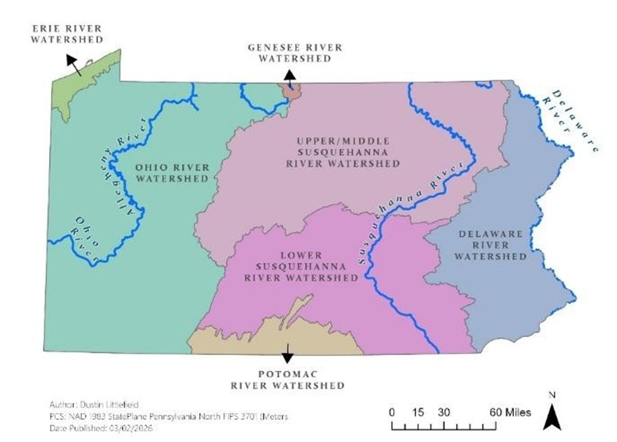

# Pennsylvania-Hydrology-ML-Streamflow-Forecasting

---

**Author:** Dustin Littlefield

**Project Type:** Hydrology and Climate Analysis

**Tags:** `Hydrology` `Remote Sensing` `ArcGIS Pro` `Runoff Trends` `TerraClimate` `ArcGIS Space Time Cube` `Random Forest Forecasting`

## Overview
This project analyzes long‑term hydrologic change across Pennsylvania and builds a machine‑learning–based forecast of monthly streamflow using TerraClimate data (1958–2024). The workflow integrates spatial statistics, time‑series analysis, and Random Forest forecasting to identify climate‑driven trends in runoff and evaluate regional flood and drought risk.

<figure>
  <figcaption style="font-size:0.9em; margin-bottom:8px;">
    <strong>Figure 1.</strong> General watershed regions in Pennsylvania 
    <em>Map Author: Dustin Littlefield PCS: NAD 1983 Pennsylvania North (Meters) Source: Watershed boundaries courtesy of the Pennsylvania Department of Environmental Protection (PADEP)</em>  

  </figcaption>
  
  </figure>

## Data

**Primary Data Source:** TerraClimate (1958–2024)  
- Monthly 4‑km global climate and water‑balance variables, including Precipitation, Maximum Temperature (TMAX), Actual Evapotranspiration (AET), Runoff (Q), Soil Moisture, and Reference ET

**Spatial Data**
- Pennsylvania HUC‑8 watershed boundaries (PA DEP)

## Methodology
### Trend Analysis
- Bivariate z‑score and p‑value mapping of long‑term runoff trends
- Identifies statistically significant increases or stability in streamflow
- Magenta = stable but significant; light blue = strong increasing trends

### Spatiotemporal Correlation
- Time Series Cross‑Correlation between TMAX and Runoff (Q)
- Negative correlations dominate, especially in southwestern PA
- Indicates higher drought sensitivity as temperatures rise
- Example from report: “The darker blue shades indicate that this region is more sensitive to rising temperatures.”

### Random Forest Forecasting
- Space‑Time Cube with monthly TerraClimate data
- Hyperparameter tuning:
    - Tree Depth: 20
    - Leaf Size: default
    - Training %: 100%
    - Trees: 150 (RMSE = 13.20 mm/month)
- Forecast generated for April 2025 to capture snowmelt

## Results
### Runoff Trends
- Central and western PA show stable but significant trends
- Northwest and eastern regions show strong increases in runoff
- Indicates elevated flood risk in these areas

### Temperature–Runoff Sensitivity
- Strongest negative correlations in the Pittsburgh region
- Higher temperatures → increased evapotranspiration → reduced runoff
- Greater drought vulnerability in southwestern watersheds

### Forecast Outputs (April 2025)
- Highest predicted streamflow in Upper Susquehanna and Ohio River watersheds
- Lower values in Lower Susquehanna and Potomac regions
- Highest RMSE in the Delaware watershed and northern Ohio basin
- Lowest RMSE in southern watersheds

<figure>
  <figcaption style="font-size:0.9em; margin-bottom:8px;">
    <strong>Figure 2.</strong> ArcGIS Forest-Based forecast results for mean monthly streamflow in Pennsylvania. Predictions for April 2025 were modelled from monthly TerraClimate data (1958 – 2024) and are mapped with HUC-8 watershed regions in Pennsylvania to identify trends. Panels are: (1) April 2025 forecasted mean runoff, (2) Root Mean Square Error (RMSE) for predicted April 2025 mean runoff, and (3) Historical monthly mean runoff for April (1958 – 2024). 
    <em>Map Author: Dustin Littlefield PCS: NAD 1983 Pennsylvania North (Meters) Source: Watershed boundaries courtesy of the Pennsylvania Department of Environmental Protection (PADEP)</em>  

  </figcaption>
  
  </figure>
