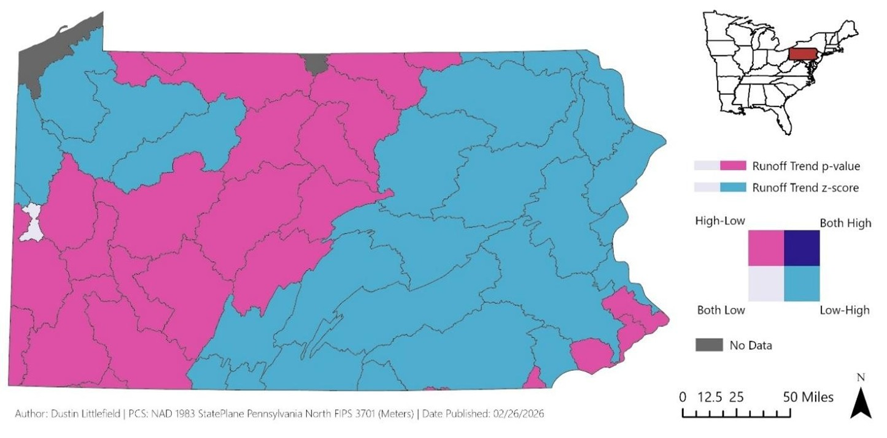
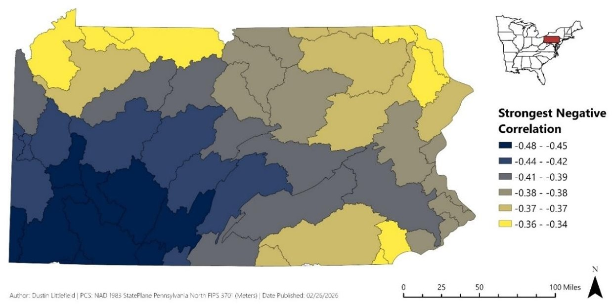
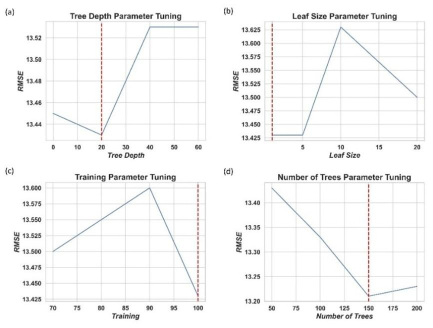

# *Random Forest–Based Streamflow Forecasting Using Long‑Term Climate and Hydrologic Data in Pennsylvania*

**Author:** Dustin Littlefield  
**Portfolio:** https://github.com/dustinlit  
**Project Type:** `Hydrology` `Climate Analysis` `Machine Learning`  
**Technologies:** `ArcGIS Pro` `TerraClimate` `Space Time Cube` `Random Forest` `Python`  
**Last Updated:** March 2026

## Introduction 
As global temperatures increase due to increased concentrations of greenhouse gases, direct effects on the earth’s atmospheric systems are expected. According to Thomas G. Huntington (2010), as global temperatures increase, the hydrologic cycle will intensify causing alterations in the patterns of rainfall, evapotranspiration rates, and runoff rates. These changes will lead to greater variability in streamflow due to heavier rainfall events and extended drought periods. Ultimately affecting regional and seasonal water availability.  

Water supplies are relied upon for urban use, agriculture, and are important for ecological health. Forecasting and tracking these effects can guide decisions about flood risk mitigation, future agricultural planning, and water resource management. Areas with heavy seasonal snowfall may be particularly sensitive as moisture is captured to be released in the spring. Accurate forecasts of snowmelt are critical for managing flows into the region’s dams, reservoirs, and waterways.  

Random Forest forecasting, a machine learning algorithm, provides a proven accurate and reproducible method of prediction. This algorithm is appropriate for hydrologic modelling because it can capture the non-linear complex relationships between streamflow and climate related factors. In a 2024 study, Gaertner (2024) lists several reasons why the random forest algorithm is effective: (1) It is able to learn directly from the data without the need for time consuming physical modelling, (2) It is shown to be more computationally efficient than other algorithms, and (3) it has the ability to incorporate multiple climactic factors that influence streamflow. 

As climate pressures grow, understanding how water moves across Pennsylvania becomes increasingly important for forecasting and planning. Due to the unique geographical makeup and expanse of Pennsylvania, in 2022, the Pennsylvania Department of Environmental Protection (n.d.) divided the state into 6 major watershed regions (Figure 4). The goal of these regions was to optimize water resource planning. Appalachian Mountains divide the runoff into three dominant watershed regions. The western portion of the state is the Ohio river watershed containing the Allegheny and Ohio rivers. Runoff from central Pennsylvania drains into the Susquehanna and Potomac watersheds, while the eastern portion of the state drains to the Delaware river. 

<figure>
  <figcaption style="font-size:0.9em; margin-bottom:8px;">
    <strong>Figure 1.</strong> General watershed regions in Pennsylvania.  
    <em>Map Author: Dustin Littlefield PCS: NAD 1983 Pennsylvania North (Meters)   Source: Watershed boundaries courtesy of the Pennsylvania Department of   Environmental Protection (PADEP) </em>
  </figcaption>
  
</figure>
 
## Data 
Terraclimate is a global raster dataset of climate related variables with monthly coverage from 1958 to present day. These variables are interpolated to a spatial resolution of 4-km from multiple coarser global datasets. It aggregates the factors from multiple sources including weather station readings and remote sensing derived factors to fill any gaps in global coverage (Abatzoglou, Dobrowski, Parks, & Hegewisch, 2018). Completeness of the dataset has made this the standard for modern climate analysis. Core factors are focused on climatic water balance and include precipitation, maximum and minimum temperature, wind speed, vapor pressure, and solar radiation. Terraclimate additionally derives water balance focused factors including Reference Evapotranspiration (ET₀), Actual Evapotranspiration (AET), Soil Moisture, Runoff (Q), and Climatic Water Deficit. 

The variables of interest in this study are: 

- **Actual Evapotranspiration (AET; mm/month)**: This is a measure of water that is lost from soil and vegetation. It is often used in indicators of drought conditions. 
- **Precipitation (mm/month)**: Total monthly rain and snowfall. 
- **Maximum Temperature (TMAX; Celsius)**: Average daily maximum temperature for the given month. 
- **Runoff (Q; mm/month)**: A measure of moisture that exceeds the holding capacity of soil and vegetation 

## Methodology and Results 
### Streamflow Trends 
Figure 2 depicts a bivariate trend analysis for runoff among the HUC-8 zones in 
Pennsylvania. Z-scores indicate the strength of the change a region is undergoing, while p-values indicate that the trend is significant and not random chance. Areas in magenta have a high significance but low z-scores, indicating that streamflow has remained stable. Light blue regions show more variability while also being significant. Much of central and western PA are magenta, indicating that even though it is statistically meaningful, the amount of change is modest. In contrast, the pockets of light blue clustered in the northwest and much of the eastern region of the state show distinct statistically significant trends with low p values and high z scores demonstrating that these areas are experiencing increased runoff giving them an increased flood risk.  

<figure>
  <figcaption style="font-size:0.9em; margin-bottom:8px;">
    <strong>Figure 2.</strong> Bivariate trend map of Pennsylvania HUC-8 watershed regions from 1958-2024   showing long-term runoff trends with each region’s p-value and z-score.  
    <em>Map Author: Dustin Littlefield PCS: NAD 1983 Pennsylvania North (Meters)   Source: Watershed boundaries courtesy of the Pennsylvania Department of Environmental Protection (PADEP)</em>
  </figcaption>
  
</figure>

### Spatiotemporal Patterns 
Time Series Cross Correlation was used to evaluate the relationship between monthly maximum temperature (TMAX) and runoff (Qrunoff) in HUC-8 watershed regions of Pennsylvania. This tool works by measuring the correlation between two time series datasets while identifying any lag in the relationship between two factors. The output will be in the range of 1 (strongest positive correlation) to -1 (strongest negative correlation) indicating the nature and strength of the relationship. A negative correlation indicates that there is an inverse relationship between the factors, as the primary increases the secondary factor decreases. A positive correlation identifies a direct relationship as both factors increase in proportion.  

As temperatures rise, plants and soil lose more moisture through evapotranspiration which decreases the amount of moisture saturation. More rainwater is absorbed and regions experience less runoff. Figure 2 shows a clear spatial pattern of the negative correlation between maximum temperatures and runoff. The strongest relationships are in the southwest region around Pittsburgh; the darker blue shades indicate that this region is more sensitive to rising temperatures. This creates greater variability in runoff predictions and makes the region more susceptible to drought conditions.  

<figure>
  <figcaption style="font-size:0.9em; margin-bottom:8px;">
    <strong>Figure 3.</strong> Pennsylvania HUC-8 zones displaying Time Series Cross Correlation strongest negative correlation.   Primary variable is runoff (Qrunoff) and secondary variable is monthly maximum temperature (TMAX).  
    <em>Map Author: Dustin Littlefield PCS: NAD 1983 Pennsylvania North (Meters)  Source: Watershed boundaries courtesy of the Pennsylvania Department of Environmental Protection (PADEP)</em>
  </figcaption>
  
</figure>

### Random Forest Forecasting 
According to ESRI (Esri, n.d.), The Random Forest Forecasting is an algorithm used to predict the outcome of future time slices of time series of a space-time cube, which is a data structure used by ESRI to manage multidimensional data. For time series, the algorithm determines results from multiple decision trees using randomly selected slices of data. These results are then averaged to produce the final predictions for a period. For this study, the TerraClimate data is indexed with a monthly time dimension in addition to x-y spatial coordinate data. 

Tunable parameters for this model include: 

- **Number of Time Steps** – This dictates the number of time periods that the algorithm will exclude from the prediction. To prevent data leakage in time series data, a time aware approach should be used. This ensures that the algorithm does not inadvertently use future results in the predictions. Failure to do this will cause the training scores to appear great but performance on new data will be poor. 160 months of consecutive data are used for this analysis.   
- **Maximum Tree Depth** – Indicates how many times the data should be split. Trees that are too shallow may fail to detect significant patterns, while trees that are too deep may cause overfitting. Optimum depth in this case was determined to be 20 (Figure 3a) 
- **Minimum Leaf Size** – This parameter determines the minimum size a branch must be to become a distinct leaf, the endpoint split containing the final grouping of the data. Larger leaf sizes will create more generalized predictions and reduce computing time, while smaller sizes may encourage overfitting but will produce more detailed results. Figure 3b shows that the default setting produces optimal results. 
- **Percentage of Training Available per Tree** – This is an optional internal validation parameter that the algorithm may use in addition the original chronological subset. A smaller percentage may help to further optimize parameters. Experimentation determined that the default size of 100 percent delivers best performance (Figure 3c). 
- **Number of Trees** – Sets the number of trees to generate. Smaller numbers of trees will generate a quicker model with less accurate results, this is often useful when hyperparameter tuning of large datasets. A larger number of trees will produce more accurate average results but may dramatically increase computation time. After experimenting with tree sizes 50,100,150, and 200, it was determined that the optimum number of trees is 150, producing the lowest RMSE of 13.20 mm/month (Figure 3d). 

<figure>
  <figcaption style="font-size:0.9em; margin-bottom:8px;">
    <strong>Figure 4.</strong> Hyperparameter tuning results for the Forest-Based Forecast model. Relevant parameters were tested   with 50 trees for efficiency. Optimum results are determined by the smallest average Root Mean Square Error (RMSE)   for: (a) maximum tree depth, (b) minimum leaf size (0 represents default), (c) percentage of training available per tree,   and (d) number of trees. Vertical dashed lines indicate the optimum parameter value.
  </figcaption>
  
</figure>

### Forest Based Forecast Results 

The spatial distribution of predicted streamflow for April of 2025 shows a clear increase trending from the south to the north (Figure 5). The Upper Susquehanna and Ohio River watersheds exhibit the highest predicted streamflow.  This is likely due to the delayed snowmelt in the northern regions compared to the south. In contrast, the Lower Susquehanna and Potomac regions in the south consistently show lower runoff amounts. The RMSE shows greatest variability in the Delaware watershed in the eastern portion of the state and the northern part of the Ohio river watershed. The predictions in these areas are less reliable, maybe due to variability in the degree and duration of the snowmelt. Low RMSE values in the southern watershed regions including the lower Susquehanna and Ohio river watersheds indicate that the model captures the relationship between climate factors and runoff response with more confidence. 

<figure>
  <figcaption style="font-size:0.9em; margin-bottom:8px;">
    <strong>Figure 5.</strong> ArcGIS Forest-Based forecast results for mean monthly streamflow in Pennsylvania.   Predictions for April 2025 were modelled from monthly TerraClimate data (1958 – 2024)   and are mapped with HUC-8 watershed regions in Pennsylvania to identify trends. Panels are:   (1) April 2025 forecasted mean runoff   (2) Root Mean Square Error (RMSE) for predicted April 2025 mean runoff   (3) Historical monthly mean runoff for April (1958 – 2024).  
    <em>Map Author: Dustin Littlefield PCS: NAD 1983 Pennsylvania North (Meters)   Source: Watershed boundaries courtesy of the Pennsylvania Department of Environmental Protection (PADEP)</em>
  </figcaption>
  
</figure>

## Discussion 
The results of this case study demonstrate the effectiveness of machine learning methods to generate spatial insights from large datasets and identify trends that may be missed when using statistical averages alone. Forest-based Forecasts of Pennsylvania reveal some areas have increased runoff variability leading to increased flood risk or susceptibility to drought conditions. Spatial-based climate forecasting can rapidly provide the framework for water resource planning for the entire state while adapting to changing climate conditions. 

Beyond Pennsylvania, this analysis can be invaluable in regions that either depend on snowpack for water reserves or must deal with excess runoff causing increased flood risk. Much of California depends on the snowmelt from the Sierra Nevada Mountains to provide water for agricultural and municipal use. Building frequent machine learning based forecast models can help the state anticipate varying levels of runoff and adjust strategies for maintaining water reservoirs. 

## Conclusion 
This module deepened my understanding of hydrology and its relationship with climate. It is especially relevant in the high desert and dry regions of the west coast where population centers and agriculture are dependent on snowmelt producing adequate runoff to maintain water supplies. As a professional GIS analyst, working with multidimensional climate data and machine learning methods like forecasting are valuable skill additions as climate changes cause historical measures to be less reliable.  

An initial challenge of the module was the symbolization and mapping of hydrological features. This is more complicated due to the crowded nature of water features and terrain integration. Identifying a focus of analysis was an additional challenge as research quickly revealed how complex hydrology can be. Ultimately, I learned a good deal about climate’s relationship with hydrology and look forward to building on this knowledge in the future. 

## References 
Huntington, T. G. (2010). Climate warming-induced intensification of the hydrologic cycle: An assessment of the published record and potential impacts on agriculture. Advances in Agronomy, 109, 1–53. https://doi.org/10.1016/B978-0-12-385040-9.00001-3

Abatzoglou, J. T., Dobrowski, S. Z., Parks, S. A., & Hegewisch, K. C. (2018). TerraClimate, a highresolution global dataset of monthly climate and climatic water balance from 1958–2015. Scientific Data, 5, Article 170191. https://doi.org/10.1038/sdata.2017.191 

Gaertner, B. (2024). Geospatial patterns in runoff projections using random forest–based 
forecasting of time-series data for the mid-Atlantic region of the United States. Science of the Total Environment, 912, Article 169211. https://doi.org/10.1016/j.scitotenv.2023.169211 

Esri. (n.d.). Forest-based and Boosted Classification and Regression (Spatial Statistics). ArcGIS Pro Documentation. Retrieved March 2, 2026, from https://pro.arcgis.com/en/pro-app/latest/toolreference/spatial-statistics/forestbasedclassificationregression.htm 

Pennsylvania Department of Environmental Protection. (n.d.). The digital water atlas. ArcGIS 
StoryMaps. https://storymaps.arcgis.com/stories/d945de2b227b44f5adad48faa36af929 
